# One Time Pad GTK

A Libre, One Time Pad program written in python3.10 and GTK for UI.

# Functionalities

- Generate Keys

- Encrypt

- Decrypt

- Options (*Optional*) 

# Posible Security issues

- Key randomness (Need to generate random keys) 
- Key storage: it is down to the user to make sure the keys are stored securely and destroyed after use.
- Key reuse: Users should not reuse keys, otherwise all security goes out the window.

# Dependencies

## System

- python3.10

- python3.10-dev

- evince

## Python

- PyGObject>=3.4.2
- PyNaCl>=1.5.0

## Install Instructions

```bash
python3.10 -m venv .venv
source .venv/bin/activate
pip3 install -r requirements.txt
pyinstaller main.py --add-data "onetimepadui.gresource:." --add-data "assets:." --onefile
./dist/bin/main
```

# Screenshots

## Main Menu

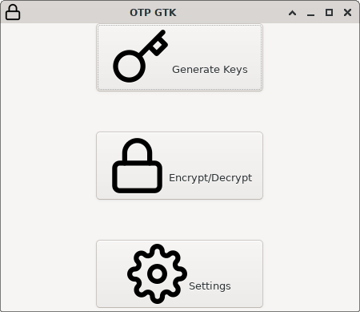

## Generate Keys

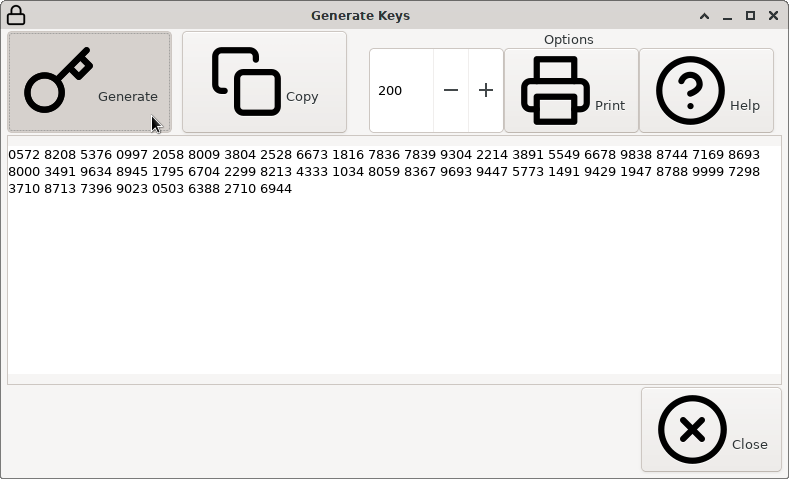

## Printing

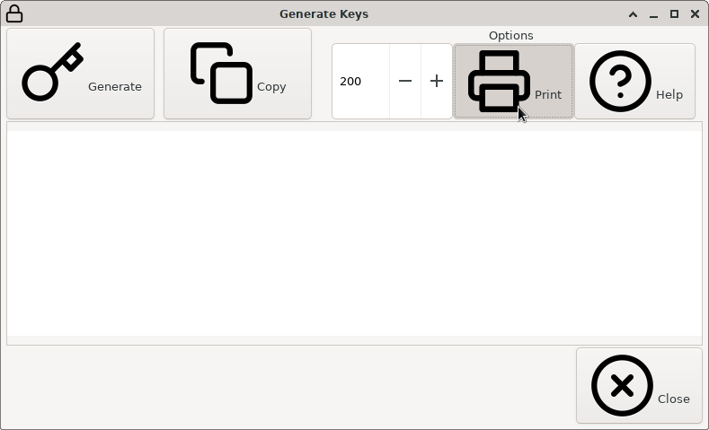

### Dialog

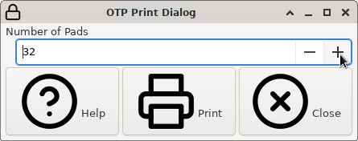

### Preview

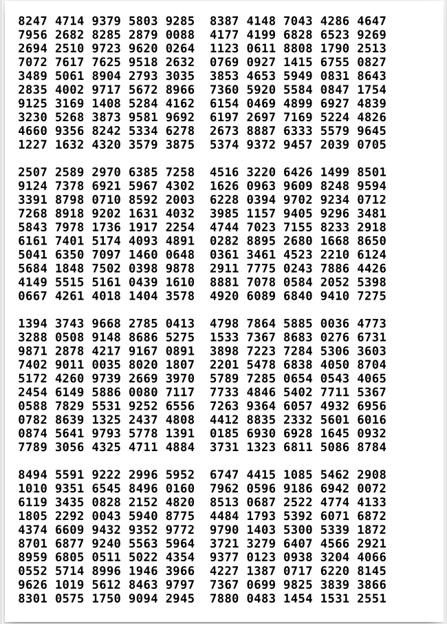

## Encrypt

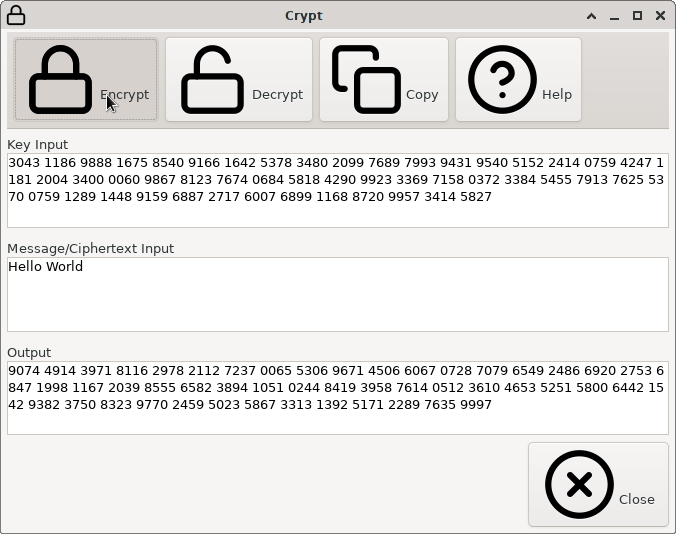

## Decrypt

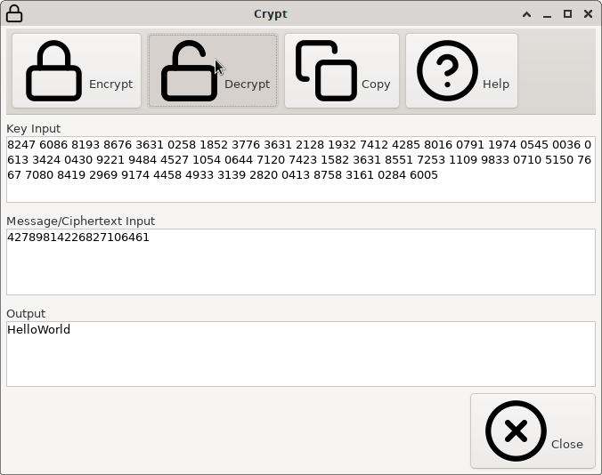

## Settings

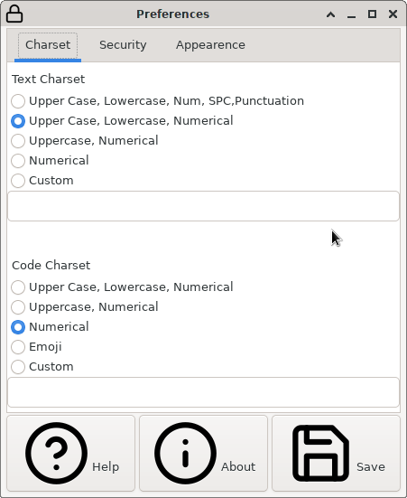

### Security

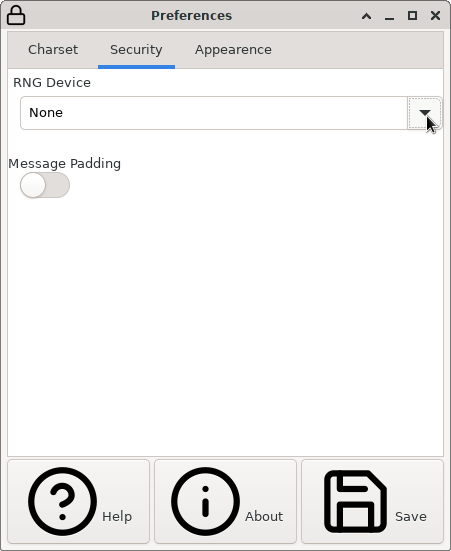

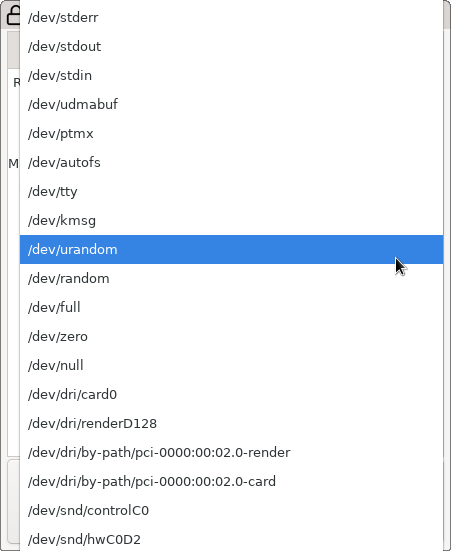

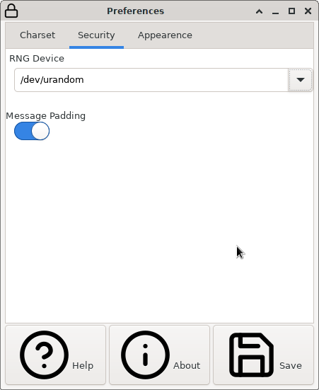

### Appearence

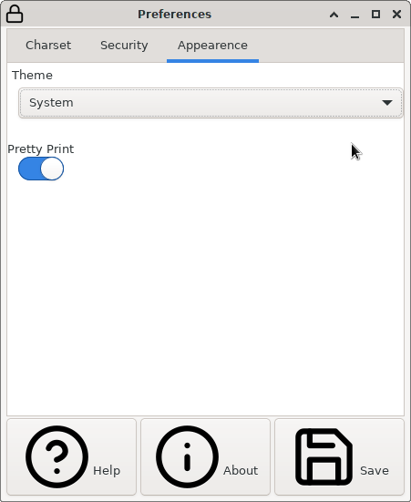
